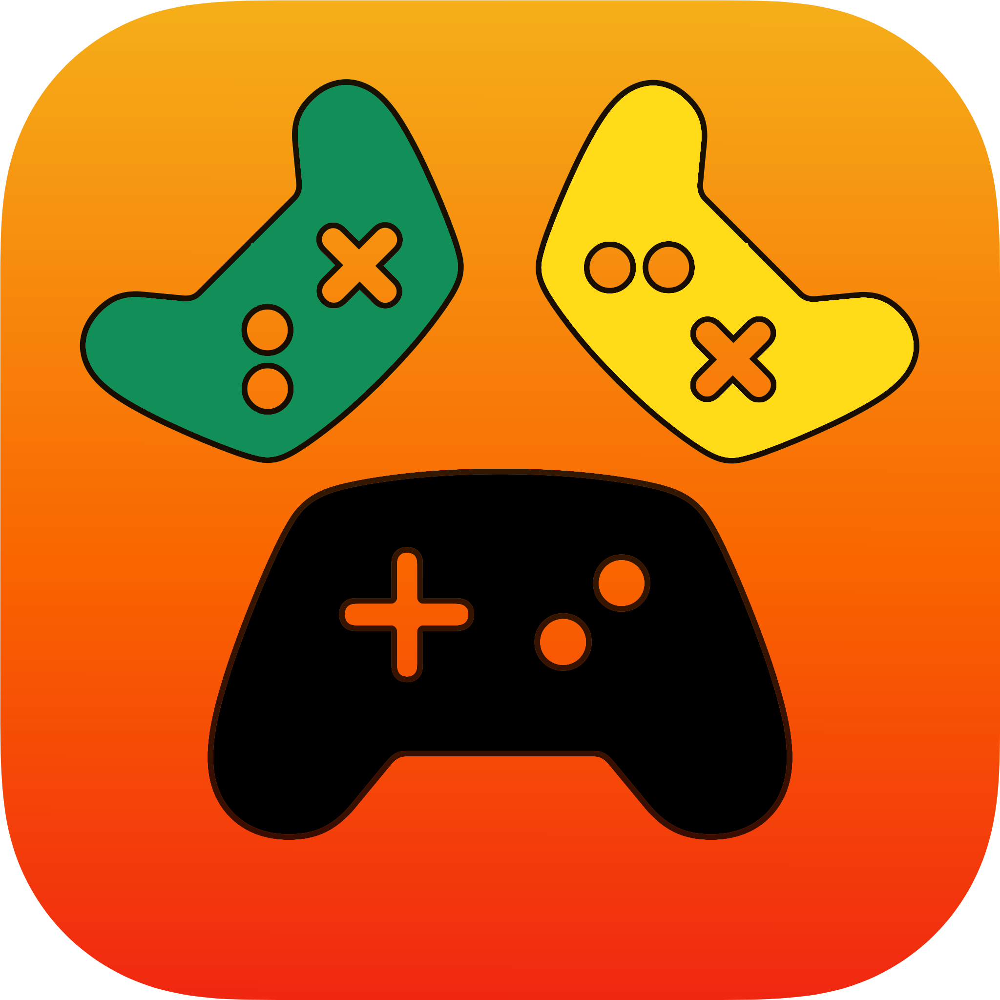
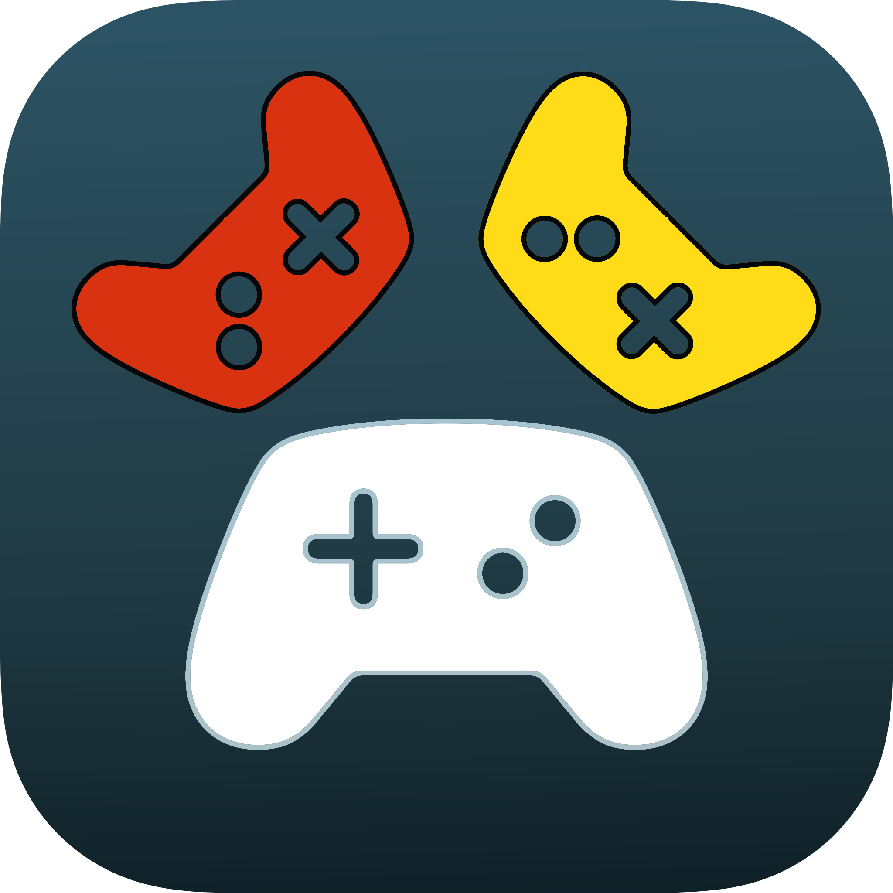

<p align="left">&nbsp;</p>

# GameKitUI.swift

## GameKit (GameCenter) helper for SwiftUI

GameKitUI is **created and maintaned with ❥** by Sascha Muellner.

---
[](https://github.com/SwiftPackageRepository/GameKitUI.swift/actions?query=workflow%3ASwift)
[](https://codecov.io/gh/SwiftPackageRepository/GameKitUI.swift)
[](https://github.com/SwiftPackageRepository/GameKitUI.swift/blob/main/LICENSE)

[](https://swiftpackageindex.com/SwiftPackageRepository/GameKitUI.swift)
[](https://swiftpackageindex.com/SwiftPackageRepository/GameKitUI.swift)
[](https://github.com/apple/swift-package-manager)
[](https://SwiftPackageRepository.github.io/GameKitUI.swift)


## What?
This is a **Swift** package with support for iOS that allows to use GameKit with SwiftUI. 

## Requirements

The latest version of GameKitUI requires:

- Swift 5+
- iOS 13+
- Xcode 11+

## Installation

### Swift Package Manager
Using SPM add the following to your dependencies

``` 'GameKitUI', 'main', 'https://github.com/SwiftPackageRepository/GameKitUI.swift.git' ```

## How to use?


### Views

#### GameCenter Authentication

To authenticate the player with GameCenter just show the authentication view **GKAuthenticationView**. 

```swift
import SwiftUI
import GameKitUI

struct ContentView: View {
	var body: some View {
		GKAuthenticationView { (state) in
			switch state {
			    case .started:
			    	print("Authentication Started")
			    	break
			    case .failed:
			    	print("Failed")
			    	break
			    case .deauthenticated:
					print("Deauthenticated")
			      	break
			    case .succeeded:
			    	break
			}
		} failed: { (error) in
			print("Failed: \(error.localizedDescription)")
		} authenticated: { (playerName) in
			print("Hello \(playerName)")
		}
	}
}
```

#### GameKit Invite

Invites created by a  GameKit MatchMaker or TurnBasedMatchmaker can be handled using a  **GKMatchMakerView**. 

```swift
import SwiftUI
import GameKit
import GameKitUI

struct ContentView: View {
    var body: some View {
        GKInviteView(
            invite: GKInvite()
        ) {
        } failed: { (error) in
            print("Invitation Failed: \(error.localizedDescription)")
        } started: { (match) in
            print("Match Started")
        }
    }
}
```

#### GameKit MatchMaker

Match making for a live match can be initiated via the **GKMatchMakerView**. 

```swift
import SwiftUI
import GameKitUI

struct ContentView: View {
	var body: some View {
		GKMatchMakerView(
                    minPlayers: 2,
                    maxPlayers: 4,
                    inviteMessage: "Let us play together!"
                ) {
                    print("Player Canceled")
                } failed: { (error) in
                    print("Match Making Failed: \(error.localizedDescription)")
                } started: { (match) in
                    print("Match Started")
                }
	}
}
```

#### GameKit TurnBasedMatchmaker

To start a turn based match use **GKTurnBasedMatchmakerView**. 

```swift
import SwiftUI
import GameKitUI

struct ContentView: View {
	var body: some View {
		GKTurnBasedMatchmakerView(
                    minPlayers: 2,
                    maxPlayers: 4,
                    inviteMessage: "Let us play together!"
                ) {
                    print("Player Canceled")
                } failed: { (error) in
                    print("Match Making Failed: \(error.localizedDescription)")
                } started: { (match) in
                    print("Match Started")
                }
	}
}
```

### GameKit Manager

#### GKMatchManager

GameKitUI views rely on a manager singelton **GKMatchManager**, which listens to GameKit state changes of the match making process.
Changes to the local player **GKLocalPlayer**, invites **GKInvite** or matches **GKMatch** can be observed using the provided public subjects **CurrentValueSubject**.

```swift
import SwiftUI
import GameKitUI

class ViewModel: ObservableObject {

    @Published public var gkInvite: GKInvite?
    @Published public var gkMatch: GKMatch?

    private var cancellableInvite: AnyCancellable?
    private var cancellableMatch: AnyCancellable?
    private var cancellableLocalPlayer: AnyCancellable?

    public init() {
        self.cancellableInvite = GKMatchManager
            .shared
            .invite
            .sink { (invite) in
                self.gkInvite = invite.gkInvite
        }
        self.cancellableMatch = GKMatchManager
            .shared
            .match
            .sink { (match) in
                self.gkMatch = match.gkMatch
        }
        self.cancellableLocalPlayer = GKMatchManager
            .shared
            .localPlayer
            .sink { (localPlayer) in
                // current GKLocalPlayer.local
        }
    }
    
    deinit() {
        self.cancellableInvite?.cancel()
        self.cancellableMatch?.cancel()
        self.cancellableLocalPlayer?.cancel()
    }
}
```

### Examples

#### GKMatchMaker Example

The provided **GKMatchMaker** example, includes a full working SwiftUI solution for handling GameKit matchmaking.
Just copy the file **Config.xcconfig-example** to **Config.xcconfig** and add your development team ID for the variable **XCCONFIG_DEVELOPMENT_TEAM** and a valid Bundle ID with GameCenter support for **XCCONFIG_BUNDLE_ID**.
The **Config.xcconfig** should now look something like this:

```config
// Configuration settings file format documentation can be found at:
// https://help.apple.com/xcode/#/dev745c5c974

XCCONFIG_DEVELOPMENT_TEAM = 9988XX7D42 // YOUR DEVELOPMENT TEAM ID
XCCONFIG_BUNDLE_ID = com.yourcompany.ProductName // A BUNDLE ID WITH SUPPORT FOR THE GAMECENTER CAPABILITY
```


Then open the **GKMatchMaker.xcodeproj**  and run it on as many **real hardware** devices to test the GameKit match making.


## Documentation
+ [Apple Documentation GameKit](https://developer.apple.com/documentation/gamekit/)
+ [raywenderlich.com: Game Center for iOS: Building a Turn-Based Game](https://www.raywenderlich.com/7544-game-center-for-ios-building-a-turn-based-game)
+ [raywenderlich.com: Game Center Tutorial: How To Make A Simple Multiplayer Game with Sprite Kit: Part 1/2](https://www.raywenderlich.com/3074-game-center-tutorial-for-ios-how-to-make-a-simple-multiplayer-game-part-1-2)
+ [Medium: GameKit Real Time Multiplayer Tutorial](https://link.medium.com/Mwg3mSi4Ebb)


